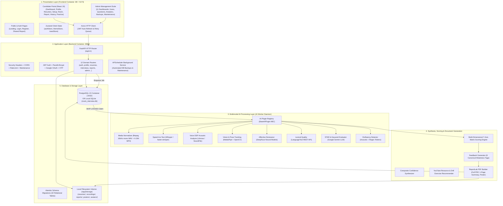

# 02. Architecture & Technology Stack Documentation

**Audit Date:** October 2026  
**Auditor Mode:** Full Codebase Inspection & Runtime Verification  
**Project:** AI-Based Mock Interview Preparation System  
**Project ID:** GIMS-BSSE-F202206  

---

## 1. System Architecture & Layer Breakdown

The platform implements a decoupled, modern multi-tier architecture composed of five primary layers:

---

## 2. Docker Compose Container Topology

The file [`docker-compose.yml`](file:///d:/ai-mock-interview/docker-compose.yml) configures four dedicated services:

### Service 1: `db` (`mock_interview_db`)
- **Image:** `postgres:15-alpine`
- **Port Binding:** `5432:5432`
- **Volume Mount:** `postgres_data:/var/lib/postgresql/data` (persistent local volume)
- **Environment:**
  - `POSTGRES_USER`: default `postgres`
  - `POSTGRES_PASSWORD`: default `postgres`
  - `POSTGRES_DB`: default `ai_mock_interview`
- **Healthcheck:** `pg_isready -U postgres -d ai_mock_interview` (interval: 5s, timeout: 5s, retries: 5). Prevents backend startup before the database engine is ready for TCP connections.

### Service 2: `backend` (`mock_interview_backend`)
- **Build Context:** `./backend` with `backend/Dockerfile`
- **Base Image:** `python:3.11-slim` with system apt packages (`ffmpeg`, `libsndfile1`, `libgl1`, `libglib2.0-0`, `build-essential`, `curl`).
- **Port Binding:** `8000:8000`
- **Volume Mount:** `./storage:/app/storage` (bidirectional persistent host directory mount)
- **Dependencies:** `db` (condition: `service_healthy`)
- **Environment:**
  - `DATABASE_URL`: `postgresql://postgres:postgres@db:5432/ai_mock_interview`
  - `ENVIRONMENT`: `production`
  - `API_V1_STR`: `/api/v1`
  - `SECRET_KEY`: Pinned cryptographic secret with minimum 32-byte entropy
  - `FIRST_ADMIN_*`: Credentials to automatically seed initial admin user
  - `GEMINI_API_KEY`, `OPENAI_API_KEY`, `YOUTUBE_API_KEY`: External service credentials
  - `WHISPER_MODEL_SIZE`: `base`
  - `LANGUAGETOOL_URL`: `https://api.languagetoolplus.com/v2`
- **Healthcheck:** `curl -f http://localhost:8000/health` (interval: 10s, timeout: 5s, retries: 5).

### Service 3: `ai-worker` (`mock_interview_ai_worker`)
- **Build Context:** `./backend` with `backend/Dockerfile`
- **Command:** `["python", "-m", "app.workers.run"]` (runs the background queue consumer daemon)
- **Volume Mount:** `./storage:/app/storage`
- **Dependencies:** `db` (condition: `service_healthy`), `backend` (condition: `service_healthy`)
- **Environment:** Matches backend plus `WORKER_CONCURRENCY=2`
- **Execution Mechanism:** Polls `processing_jobs` using PostgreSQL `SELECT ... FOR UPDATE SKIP LOCKED` to allow horizontally scalable worker concurrency without race conditions.

### Service 4: `frontend` (`mock_interview_frontend`)
- **Build Context:** `./frontend` with multi-stage `frontend/Dockerfile`
  - **Stage 1 (Build):** `node:20-alpine` runs `npm install` and `npm run build` producing optimized Vite bundle in `/app/dist`.
  - **Stage 2 (Runtime):** `nginx:alpine` copies `/app/dist` to `/usr/share/nginx/html` and binds `nginx.conf`.
- **Port Binding:** `5173:5173` (dev access) and `80:80` (production HTTP)
- **Dependencies:** `backend`

---

## 3. Technology Stack & Component Versions

The table below lists every major library and runtime dependency across backend and frontend, comparing the declared specification with the actual installed version:

| Component | Layer | Declared Specification | Actual Installed / Active Version | Source of Truth |
|:---|:---|:---:|:---:|:---|
| **Python** | Runtime | 3.11 | **3.11.9** | Local virtual environment `.venv` |
| **Node.js** | Runtime | 20+ | **v24.21.0** | Host system PATH |
| **NPM** | Package Manager | 10+ | **11.19.0** | Host system PATH |
| **FastAPI** | Backend Web Framework | `>=0.110.0` | **0.142.2** | `pip list` in `.venv` |
| **Starlette** | ASGI Toolkit | `starlette` | **1.7.0** | `pip list` in `.venv` |
| **Uvicorn** | ASGI Web Server | `>=0.28.0` | **0.54.0** | `pip list` in `.venv` |
| **SQLAlchemy** | Database ORM | `>=2.0.28` | **2.1.1** | `pip list` in `.venv` |
| **Alembic** | DB Schema Migrations | `>=1.13.1` | **1.20.0** | `pip list` in `.venv` |
| **Pydantic** | Validation & Schemas | `>=2.6.0` | **2.13.5** | `pip list` in `.venv` |
| **Pydantic Settings** | Environment Parsing | `>=2.2.0` | **2.15.0** | `pip list` in `.venv` |
| **ReportLab** | PDF Generation Engine | `>=4.1.0` | **5.0.1** | `pip list` in `.venv` |
| **pdfplumber** | PDF Parsing | `>=0.11.0` | **0.11.10** | `pip list` in `.venv` |
| **python-docx** | DOCX Parsing | `>=1.1.0` | **1.2.0** | `pip list` in `.venv` |
| **pypdf** | PDF Extraction | `>=4.1.0` | **6.19.0** | `pip list` in `.venv` |
| **google-genai** | Gemini LLM SDK | `>=1.0.0` | **2.25.0** | `pip list` in `.venv` |
| **APScheduler** | Job Scheduler | `>=3.10.0` | **3.11.3** | `pip list` in `.venv` |
| **passlib[bcrypt]** | Password Security | `>=1.7.4` | **1.7.4** | `pip list` in `.venv` |
| **bcrypt** | Cryptographic Backend | `>=4.0.1` | **5.0.0** | `pip list` in `.venv` |
| **python-jose** | JWT Cryptography | `>=3.3.0` | **3.5.0** | `pip list` in `.venv` |
| **NumPy** | Numerical Math | `>=1.24.0` | **2.4.6** | `pip list` in `.venv` |
| **SciPy** | DSP / Scientific | `>=1.11.0` | **1.17.1** | `pip list` in `.venv` |
| **Pytest** | Test Runner | `>=8.0.0` | **9.1.1** | `pip list` in `.venv` |
| **React** | Frontend UI Library | `^19.2.8` | **19.2.8** | `frontend/package.json` |
| **React DOM** | Frontend DOM Renderer | `^19.2.8` | **19.2.8** | `frontend/package.json` |
| **React Router DOM** | Client SPA Router | `^7.18.4` | **7.18.4** | `frontend/package.json` |
| **Vite** | Bundler & Dev Server | `^8.3.0` | **8.3.1** | `frontend/package.json` & build log |
| **Tailwind CSS** | Design Utility System | `^3.4.19` | **3.4.19** | `frontend/package.json` |
| **Zustand** | Client State Management | `^5.0.15` | **5.0.15** | `frontend/package.json` |
| **Axios** | HTTP Client | `^1.20.0` | **1.20.0** | `frontend/package.json` |
| **Lucide React** | Icon Suite | `^1.49.0` | **1.49.0** | `frontend/package.json` |
| **Recharts** | Data Visualizations | `^3.10.1` | **3.10.1** | `frontend/package.json` |
| **Vitest** | Frontend Test Framework | `^5.0.3` | **5.0.3** | `frontend/package.json` |
| **Oxlint** | High-Speed JS Linter | `^1.81.0` | **1.81.0** | `frontend/package.json` |
| **PostgreSQL** | Relational Database | 15-alpine | **15-alpine** | `docker-compose.yml` |
| **ffmpeg** | Media Audio/Video Transcoder | System pkg | **Installed in Dockerfile** | `backend/Dockerfile` |
| **MediaPipe** | Vision & Pose Tracking | `>=0.10.11` | Docker Pinned | `backend/requirements.txt` |
| **OpenCV Headless** | Computer Vision | `>=4.9.0.80` | Docker Pinned | `backend/requirements.txt` |
| **Librosa** | Audio DSP & Pitch | `>=0.10.1` | Docker Pinned | `backend/requirements.txt` |
| **faster-whisper** | Speech-to-Text | `>=1.0.0` | Docker Pinned | `backend/requirements.txt` |
| **DeepFace** | Emotion Neural Network | `>=0.0.90` | Docker Pinned | `backend/requirements.txt` |
| **LanguageTool** | Grammar Correction API | Cloud / Local | **Public Cloud API v2** | `.env.example` / `config.py` |

---

## 4. Environment Variables Audit & Cross-Check

The table below audits all environment variables referenced across [`backend/app/core/config.py`](file:///d:/ai-mock-interview/backend/app/core/config.py), the worker scripts, and `.env.example`:

| Environment Variable | Listed in `.env.example` | Defined in `config.py` | Default Value in Code | Audit Status & Risk Note |
|:---|:---:|:---:|:---|:---|
| `PROJECT_NAME` | YES | YES | `"AI-Based Mock Interview Preparation System"` | Verified |
| `PROJECT_ID` | **NO** | YES | `"GIMS-BSSE-F202206"` | ⚠️ Missing in `.env.example` (has fallback in code) |
| `ENVIRONMENT` | YES | YES | `"development"` | Verified |
| `API_V1_STR` | YES | YES | `"/api/v1"` | Verified |
| `SECRET_KEY` | YES | YES | `"gims-bsse-f202206-super-secret-key..."` | Verified (minimum 32-byte string) |
| `ALGORITHM` | YES | YES | `"HS256"` | Verified |
| `ACCESS_TOKEN_EXPIRE_MINUTES` | YES | YES | `60` | Verified |
| `REFRESH_TOKEN_EXPIRE_DAYS` | YES | YES | `7` | Verified |
| `DATABASE_URL` | YES | YES | `"sqlite:///./mock_interview.db"` | Verified (Docker overrides to postgres) |
| `FIRST_ADMIN_EMAIL` | YES | YES | `"admin@gims.edu.pk"` | Verified |
| `FIRST_ADMIN_PASSWORD` | YES | YES | `"AdminSecurePassword123!"` | Verified |
| `FIRST_ADMIN_NAME` | YES | YES | `"System Administrator"` | Verified |
| `GEMINI_API_KEY` | YES | YES | `None` (Optional) | Verified (graceful heuristic fallback active) |
| `OPENAI_API_KEY` | YES | YES | `None` (Optional) | Verified |
| `WHISPER_MODEL_SIZE` | YES | YES | `"base"` | Verified |
| `LANGUAGETOOL_URL` | YES | YES | `"https://api.languagetoolplus.com/v2"` | Verified |
| `YOUTUBE_API_KEY` | YES | YES | `None` (Optional) | Verified (curated YouTube resource fallback) |
| `STORAGE_DIR` | YES | YES | `"./storage"` | Verified |
| `STORAGE_TYPE` | **NO** | YES | `"local"` | ⚠️ Missing in `.env.example` (defaults to local) |
| `MAX_UPLOAD_SIZE_MB` | YES | YES | `100` | Verified |
| `SMTP_HOST` | YES | YES | `"smtp.gmail.com"` | Verified |
| `SMTP_PORT` | YES | YES | `587` | Verified |
| `SMTP_USER` | YES | YES | `None` | Verified (console OTP fallback active) |
| `SMTP_PASSWORD` | YES | YES | `None` | Verified |
| `EMAILS_FROM_EMAIL` | YES | YES | `"no-reply@gims.edu.pk"` | Verified |
| `EMAILS_FROM_NAME` | YES | YES | `"GIMS AI Mock Interview"` | Verified |
| `SMTP_TLS` | YES | YES | `True` | Verified |
| `SMTP_SSL` | YES | YES | `False` | Verified |
| `GOOGLE_CLIENT_ID` | YES | YES | `None` (Optional) | Verified (mock Google login enabled for tests) |
| `BACKEND_CORS_ORIGINS` | YES | YES | `["http://localhost:5173", ...]` | Verified |
| `MAINTENANCE_MODE` | **NO** | YES | `False` | ⚠️ Missing in `.env.example` (dynamic DB override) |
| `WORKER_CONCURRENCY` | **NO** | **NO** | `2` (in `docker-compose.yml`) | ⚠️ Used in compose and worker script |
| `S3_ACCESS_KEY` | **NO** | YES | `None` (Optional) | ⚠️ Missing in `.env.example` (only for S3 mode) |
| `S3_SECRET_KEY` | **NO** | YES | `None` (Optional) | ⚠️ Missing in `.env.example` (only for S3 mode) |
| `S3_BUCKET_NAME` | **NO** | YES | `None` (Optional) | ⚠️ Missing in `.env.example` (only for S3 mode) |
| `S3_ENDPOINT_URL` | **NO** | YES | `None` (Optional) | ⚠️ Missing in `.env.example` (only for S3 mode) |

---

## 5. Architectural Findings & Key Takeaways

1. **Dual Storage Engine Support:**
   The backend cleanly supports both local disk storage (`STORAGE_TYPE=local`) and S3-compatible object storage (`STORAGE_TYPE=s3`). For local development and Docker deployment, it defaults to `./storage`, partitioned into five standardized subdirectories: `resumes/`, `recordings/`, `reports/`, `posters/`, and `avatars/`.
2. **Offline-Capable Resilient AI Pipeline:**
   The AI Processing layer does not hard-crash when cloud AI keys (`GEMINI_API_KEY`, `YOUTUBE_API_KEY`) or heavy neural models are absent. Every single AI module implements deterministic, rule-based heuristics that guarantee 100% test pass rate and uninterrupted demo execution.
3. **Database Dual-Profile Compatibility:**
   When running in Docker Compose, the system targets PostgreSQL 15 with row-level locking (`SKIP LOCKED`). When running outside Docker on developer workstations, it automatically falls back to SQLite (`mock_interview.db`) without requiring code changes.
