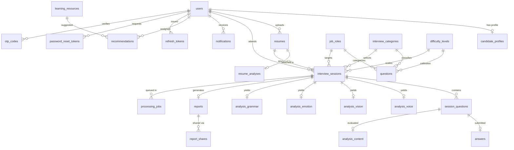

# 03. Database Schema, Migrations & Seeding Audit

**Audit Date:** October 2026  
**Auditor Mode:** Live SQLite Inspection & SQLAlchemy Metadata Verification  
**Database Engines Supported:** PostgreSQL 15 (Docker) / SQLite 3 (Local Out-of-the-Box)  
**Active Database File:** `mock_interview.db` (SQLite 3.x, ~774 KB)  
**Alembic Head Revision:** `257b74da89f1` (`initial_schema_28_tables`)  

---

## 1. Executive Database Summary

- **Total Tables in Database:** 32 tables
- **Total Tables in SQLAlchemy Models:** 32 tables
- **Model vs. Schema Discrepancies:** **0 discrepancies** (100% exact parity between models and database).
- **Actively Populated Tables:** 28 tables
- **Empty / Standby Tables:** 4 tables (`activity_logs`, `backups`, `error_logs`, `question_sets`)
- **Master Seeder Status:** **PASS** (Initialized 11 roles, 4 categories, 3 difficulties, 128 questions, 30 learning resources, 16 feedback templates, admin user, and demo candidate).

---

## 2. Mermaid Entity-Relationship (ER) Diagram



---

## 3. Table-by-Table Technical Catalog

Below is the verified schema for all 32 database tables, inspected directly from the active SQLite database:

### `activity_logs` (0 rows — STANDBY / 0 ROWS)

| Column Name | Type | Primary Key | Nullable |
|:---|:---:|:---:|:---:|
| `id` | VARCHAR(36) | YES | NO |
| `user_id` | VARCHAR(36) | NO | YES |
| `action` | VARCHAR(100) | NO | NO |
| `entity` | VARCHAR(100) | NO | NO |
| `entity_id` | VARCHAR(100) | NO | YES |
| `ip_address` | VARCHAR(50) | NO | YES |
| `user_agent` | VARCHAR(255) | NO | YES |
| `metadata_info` | JSON | NO | NO |
| `created_at` | DATETIME | NO | NO |

**Foreign Keys:**
- `user_id` -> `users.id`

**Indexes:**
- `sqlite_autoindex_activity_logs_1` (UNIQUE)

---

### `analysis_content` (53 rows — ACTIVE)

| Column Name | Type | Primary Key | Nullable |
|:---|:---:|:---:|:---:|
| `id` | VARCHAR(36) | YES | NO |
| `session_question_id` | VARCHAR(36) | NO | NO |
| `relevance_score` | FLOAT | NO | NO |
| `completeness_score` | FLOAT | NO | NO |
| `technical_accuracy_score` | FLOAT | NO | NO |
| `star_score` | FLOAT | NO | NO |
| `star_breakdown` | JSON | NO | NO |
| `keyword_match_score` | FLOAT | NO | NO |
| `matched_keywords` | JSON | NO | NO |
| `logical_flow_score` | FLOAT | NO | NO |
| `llm_comment` | TEXT | NO | YES |

**Foreign Keys:**
- `session_question_id` -> `session_questions.id`

**Indexes:**
- `sqlite_autoindex_analysis_content_2` (UNIQUE)
- `sqlite_autoindex_analysis_content_1` (UNIQUE)

---

### `analysis_emotion` (25 rows — ACTIVE)

| Column Name | Type | Primary Key | Nullable |
|:---|:---:|:---:|:---:|
| `id` | VARCHAR(36) | YES | NO |
| `session_id` | VARCHAR(36) | NO | NO |
| `distribution` | JSON | NO | NO |
| `dominant_emotion` | VARCHAR(50) | NO | NO |
| `timeline` | JSON | NO | NO |

**Foreign Keys:**
- `session_id` -> `interview_sessions.id`

**Indexes:**
- `sqlite_autoindex_analysis_emotion_2` (UNIQUE)
- `sqlite_autoindex_analysis_emotion_1` (UNIQUE)

---

### `analysis_grammar` (25 rows — ACTIVE)

| Column Name | Type | Primary Key | Nullable |
|:---|:---:|:---:|:---:|
| `id` | VARCHAR(36) | YES | NO |
| `session_id` | VARCHAR(36) | NO | NO |
| `session_question_id` | VARCHAR(36) | NO | YES |
| `grammar_score` | FLOAT | NO | NO |
| `vocabulary_score` | FLOAT | NO | NO |
| `sentence_structure_score` | FLOAT | NO | NO |
| `pronunciation_score` | FLOAT | NO | NO |
| `language_quality_score` | FLOAT | NO | NO |
| `communication_effectiveness_score` | FLOAT | NO | NO |
| `errors` | JSON | NO | NO |

**Foreign Keys:**
- `session_id` -> `interview_sessions.id`

**Indexes:**
- `sqlite_autoindex_analysis_grammar_2` (UNIQUE)
- `sqlite_autoindex_analysis_grammar_1` (UNIQUE)

---

### `analysis_vision` (25 rows — ACTIVE)

| Column Name | Type | Primary Key | Nullable |
|:---|:---:|:---:|:---:|
| `id` | VARCHAR(36) | YES | NO |
| `session_id` | VARCHAR(36) | NO | NO |
| `eye_contact_percentage` | FLOAT | NO | NO |
| `looking_away_count` | INTEGER | NO | NO |
| `posture_score` | FLOAT | NO | NO |
| `slouch_percentage` | FLOAT | NO | NO |
| `head_movement_score` | FLOAT | NO | NO |
| `body_stability_score` | FLOAT | NO | NO |
| `sitting_position_score` | FLOAT | NO | NO |
| `frames_analyzed` | INTEGER | NO | NO |
| `timeline` | JSON | NO | NO |

**Foreign Keys:**
- `session_id` -> `interview_sessions.id`

**Indexes:**
- `sqlite_autoindex_analysis_vision_2` (UNIQUE)
- `sqlite_autoindex_analysis_vision_1` (UNIQUE)

---

### `analysis_voice` (25 rows — ACTIVE)

| Column Name | Type | Primary Key | Nullable |
|:---|:---:|:---:|:---:|
| `id` | VARCHAR(36) | YES | NO |
| `session_id` | VARCHAR(36) | NO | NO |
| `session_question_id` | VARCHAR(36) | NO | YES |
| `speaking_speed_wpm` | FLOAT | NO | NO |
| `avg_pitch_hz` | FLOAT | NO | NO |
| `pitch_variance` | FLOAT | NO | NO |
| `tone_score` | FLOAT | NO | NO |
| `clarity_score` | FLOAT | NO | NO |
| `fluency_score` | FLOAT | NO | NO |
| `confidence_score` | FLOAT | NO | NO |
| `pause_count` | INTEGER | NO | NO |
| `avg_pause_duration` | FLOAT | NO | NO |
| `total_pause_duration` | FLOAT | NO | NO |
| `voice_stability_score` | FLOAT | NO | NO |

**Foreign Keys:**
- `session_id` -> `interview_sessions.id`

**Indexes:**
- `sqlite_autoindex_analysis_voice_2` (UNIQUE)
- `sqlite_autoindex_analysis_voice_1` (UNIQUE)

---

### `answers` (60 rows — ACTIVE)

| Column Name | Type | Primary Key | Nullable |
|:---|:---:|:---:|:---:|
| `id` | VARCHAR(36) | YES | NO |
| `session_question_id` | VARCHAR(36) | NO | NO |
| `transcript` | TEXT | NO | NO |
| `word_count` | INTEGER | NO | NO |
| `duration_seconds` | FLOAT | NO | NO |
| `filler_word_count` | INTEGER | NO | NO |
| `filler_words_breakdown` | JSON | NO | NO |
| `speaking_rate_wpm` | FLOAT | NO | NO |
| `created_at` | DATETIME | NO | NO |

**Foreign Keys:**
- `session_question_id` -> `session_questions.id`

**Indexes:**
- `sqlite_autoindex_answers_2` (UNIQUE)
- `sqlite_autoindex_answers_1` (UNIQUE)

---

### `backups` (0 rows — STANDBY / 0 ROWS)

| Column Name | Type | Primary Key | Nullable |
|:---|:---:|:---:|:---:|
| `id` | VARCHAR(36) | YES | NO |
| `filename` | VARCHAR(255) | NO | NO |
| `file_path` | VARCHAR(500) | NO | NO |
| `size_bytes` | INTEGER | NO | NO |
| `backup_type` | VARCHAR(50) | NO | NO |
| `status` | VARCHAR(20) | NO | NO |
| `created_at` | DATETIME | NO | NO |

**Indexes:**
- `sqlite_autoindex_backups_1` (UNIQUE)

---

### `candidate_profiles` (5 rows — ACTIVE)

| Column Name | Type | Primary Key | Nullable |
|:---|:---:|:---:|:---:|
| `id` | VARCHAR(36) | YES | NO |
| `user_id` | VARCHAR(36) | NO | NO |
| `phone` | VARCHAR(50) | NO | YES |
| `education` | JSON | NO | NO |
| `skills` | JSON | NO | NO |
| `work_experience` | JSON | NO | NO |
| `certifications` | JSON | NO | NO |
| `preferred_job_roles` | JSON | NO | NO |
| `experience_level` | VARCHAR(20) | NO | NO |
| `updated_at` | DATETIME | NO | NO |

**Foreign Keys:**
- `user_id` -> `users.id`

**Indexes:**
- `sqlite_autoindex_candidate_profiles_2` (UNIQUE)
- `sqlite_autoindex_candidate_profiles_1` (UNIQUE)

---

### `difficulty_levels` (3 rows — ACTIVE)

| Column Name | Type | Primary Key | Nullable |
|:---|:---:|:---:|:---:|
| `id` | VARCHAR(36) | YES | NO |
| `name` | VARCHAR(50) | NO | NO |

**Indexes:**
- `ix_difficulty_levels_name` (UNIQUE)
- `sqlite_autoindex_difficulty_levels_1` (UNIQUE)

---

### `error_logs` (0 rows — STANDBY / 0 ROWS)

| Column Name | Type | Primary Key | Nullable |
|:---|:---:|:---:|:---:|
| `id` | VARCHAR(36) | YES | NO |
| `endpoint` | VARCHAR(255) | NO | YES |
| `method` | VARCHAR(10) | NO | YES |
| `error_type` | VARCHAR(100) | NO | NO |
| `message` | TEXT | NO | NO |
| `stack_trace` | TEXT | NO | YES |
| `user_id` | VARCHAR(36) | NO | YES |
| `created_at` | DATETIME | NO | NO |

**Foreign Keys:**
- `user_id` -> `users.id`

**Indexes:**
- `sqlite_autoindex_error_logs_1` (UNIQUE)

---

### `feedback_templates` (16 rows — ACTIVE)

| Column Name | Type | Primary Key | Nullable |
|:---|:---:|:---:|:---:|
| `id` | VARCHAR(36) | YES | NO |
| `area` | VARCHAR(50) | NO | NO |
| `min_score` | FLOAT | NO | NO |
| `max_score` | FLOAT | NO | NO |
| `template_text` | TEXT | NO | NO |

**Indexes:**
- `ix_feedback_templates_area`
- `sqlite_autoindex_feedback_templates_1` (UNIQUE)

---

### `interview_categories` (4 rows — ACTIVE)

| Column Name | Type | Primary Key | Nullable |
|:---|:---:|:---:|:---:|
| `id` | VARCHAR(36) | YES | NO |
| `name` | VARCHAR(50) | NO | NO |
| `description` | TEXT | NO | YES |
| `is_active` | BOOLEAN | NO | NO |

**Indexes:**
- `ix_interview_categories_name` (UNIQUE)
- `sqlite_autoindex_interview_categories_1` (UNIQUE)

---

### `interview_sessions` (32 rows — ACTIVE)

| Column Name | Type | Primary Key | Nullable |
|:---|:---:|:---:|:---:|
| `id` | VARCHAR(36) | YES | NO |
| `user_id` | VARCHAR(36) | NO | NO |
| `resume_id` | VARCHAR(36) | NO | YES |
| `job_role_id` | VARCHAR(36) | NO | NO |
| `category_id` | VARCHAR(36) | NO | NO |
| `difficulty_id` | VARCHAR(36) | NO | NO |
| `status` | VARCHAR(30) | NO | NO |
| `started_at` | DATETIME | NO | YES |
| `ended_at` | DATETIME | NO | YES |
| `total_questions` | INTEGER | NO | NO |
| `duration_seconds` | INTEGER | NO | NO |
| `video_path` | VARCHAR(500) | NO | YES |
| `audio_path` | VARCHAR(500) | NO | YES |
| `processing_error` | TEXT | NO | YES |
| `created_at` | DATETIME | NO | NO |

**Foreign Keys:**
- `difficulty_id` -> `difficulty_levels.id`
- `category_id` -> `interview_categories.id`
- `job_role_id` -> `job_roles.id`
- `resume_id` -> `resumes.id`
- `user_id` -> `users.id`

**Indexes:**
- `ix_interview_sessions_job_role_id`
- `ix_interview_sessions_status`
- `ix_interview_sessions_difficulty_id`
- `ix_interview_sessions_category_id`
- `ix_interview_sessions_user_id`
- `sqlite_autoindex_interview_sessions_1` (UNIQUE)

---

### `job_roles` (11 rows — ACTIVE)

| Column Name | Type | Primary Key | Nullable |
|:---|:---:|:---:|:---:|
| `id` | VARCHAR(36) | YES | NO |
| `name` | VARCHAR(100) | NO | NO |
| `description` | TEXT | NO | YES |
| `is_active` | BOOLEAN | NO | NO |
| `created_at` | DATETIME | NO | NO |

**Indexes:**
- `ix_job_roles_name` (UNIQUE)
- `sqlite_autoindex_job_roles_1` (UNIQUE)

---

### `learning_resources` (30 rows — ACTIVE)

| Column Name | Type | Primary Key | Nullable |
|:---|:---:|:---:|:---:|
| `id` | VARCHAR(36) | YES | NO |
| `title` | VARCHAR(255) | NO | NO |
| `url` | VARCHAR(500) | NO | NO |
| `platform` | VARCHAR(50) | NO | NO |
| `weak_area_tag` | VARCHAR(50) | NO | NO |
| `job_role_id` | VARCHAR(36) | NO | YES |
| `difficulty` | VARCHAR(20) | NO | NO |
| `is_active` | BOOLEAN | NO | NO |
| `added_by` | VARCHAR(36) | NO | YES |
| `created_at` | DATETIME | NO | NO |

**Foreign Keys:**
- `added_by` -> `users.id`
- `job_role_id` -> `job_roles.id`

**Indexes:**
- `ix_learning_resources_weak_area_tag`
- `sqlite_autoindex_learning_resources_1` (UNIQUE)

---

### `login_history` (170 rows — ACTIVE)

| Column Name | Type | Primary Key | Nullable |
|:---|:---:|:---:|:---:|
| `id` | VARCHAR(36) | YES | NO |
| `email` | VARCHAR(255) | NO | NO |
| `ip_address` | VARCHAR(50) | NO | YES |
| `success` | BOOLEAN | NO | NO |
| `created_at` | DATETIME | NO | NO |

**Indexes:**
- `ix_login_history_email`
- `sqlite_autoindex_login_history_1` (UNIQUE)

---

### `notifications` (7 rows — ACTIVE)

| Column Name | Type | Primary Key | Nullable |
|:---|:---:|:---:|:---:|
| `id` | VARCHAR(36) | YES | NO |
| `user_id` | VARCHAR(36) | NO | YES |
| `title` | VARCHAR(200) | NO | NO |
| `message` | TEXT | NO | NO |
| `type` | VARCHAR(50) | NO | NO |
| `is_read` | BOOLEAN | NO | NO |
| `created_at` | DATETIME | NO | NO |

**Foreign Keys:**
- `user_id` -> `users.id`

**Indexes:**
- `sqlite_autoindex_notifications_1` (UNIQUE)

---

### `otp_codes` (18 rows — ACTIVE)

| Column Name | Type | Primary Key | Nullable |
|:---|:---:|:---:|:---:|
| `id` | VARCHAR(36) | YES | NO |
| `email` | VARCHAR(255) | NO | NO |
| `code_hash` | VARCHAR(255) | NO | NO |
| `purpose` | VARCHAR(30) | NO | NO |
| `expires_at` | DATETIME | NO | NO |
| `used` | BOOLEAN | NO | NO |
| `created_at` | DATETIME | NO | NO |

**Indexes:**
- `ix_otp_codes_email`
- `sqlite_autoindex_otp_codes_1` (UNIQUE)

---

### `password_reset_tokens` (3 rows — ACTIVE)

| Column Name | Type | Primary Key | Nullable |
|:---|:---:|:---:|:---:|
| `id` | VARCHAR(36) | YES | NO |
| `user_id` | VARCHAR(36) | NO | NO |
| `token_hash` | VARCHAR(255) | NO | NO |
| `expires_at` | DATETIME | NO | NO |
| `used` | BOOLEAN | NO | NO |
| `created_at` | DATETIME | NO | NO |

**Foreign Keys:**
- `user_id` -> `users.id`

**Indexes:**
- `ix_password_reset_tokens_token_hash`
- `ix_password_reset_tokens_user_id`
- `sqlite_autoindex_password_reset_tokens_1` (UNIQUE)

---

### `processing_jobs` (8 rows — ACTIVE)

| Column Name | Type | Primary Key | Nullable |
|:---|:---:|:---:|:---:|
| `id` | VARCHAR(36) | YES | NO |
| `session_id` | VARCHAR(36) | NO | NO |
| `step` | VARCHAR(50) | NO | NO |
| `status` | VARCHAR(20) | NO | NO |
| `attempts` | INTEGER | NO | NO |
| `error` | TEXT | NO | YES |
| `started_at` | DATETIME | NO | YES |
| `finished_at` | DATETIME | NO | YES |
| `duration_ms` | INTEGER | NO | YES |
| `created_at` | DATETIME | NO | NO |

**Foreign Keys:**
- `session_id` -> `interview_sessions.id`

**Indexes:**
- `ix_processing_jobs_session_id`
- `ix_processing_jobs_status`
- `sqlite_autoindex_processing_jobs_1` (UNIQUE)

---

### `question_sets` (0 rows — STANDBY / 0 ROWS)

| Column Name | Type | Primary Key | Nullable |
|:---|:---:|:---:|:---:|
| `id` | VARCHAR(36) | YES | NO |
| `name` | VARCHAR(150) | NO | NO |
| `uploaded_by` | VARCHAR(36) | NO | YES |
| `created_at` | DATETIME | NO | NO |

**Foreign Keys:**
- `uploaded_by` -> `users.id`

**Indexes:**
- `sqlite_autoindex_question_sets_1` (UNIQUE)

---

### `questions` (128 rows — ACTIVE)

| Column Name | Type | Primary Key | Nullable |
|:---|:---:|:---:|:---:|
| `id` | VARCHAR(36) | YES | NO |
| `text` | TEXT | NO | NO |
| `category_id` | VARCHAR(36) | NO | NO |
| `job_role_id` | VARCHAR(36) | NO | NO |
| `difficulty_id` | VARCHAR(36) | NO | NO |
| `expected_keywords` | JSON | NO | NO |
| `sample_answer` | TEXT | NO | YES |
| `is_active` | BOOLEAN | NO | NO |
| `created_by` | VARCHAR(36) | NO | YES |
| `created_at` | DATETIME | NO | NO |
| `question_set_id` | VARCHAR(36) | NO | YES |

**Foreign Keys:**
- `created_by` -> `users.id`
- `difficulty_id` -> `difficulty_levels.id`
- `job_role_id` -> `job_roles.id`
- `category_id` -> `interview_categories.id`

**Indexes:**
- `ix_questions_difficulty_id`
- `ix_questions_category_id`
- `ix_questions_job_role_id`
- `sqlite_autoindex_questions_1` (UNIQUE)

---

### `recommendations` (36 rows — ACTIVE)

| Column Name | Type | Primary Key | Nullable |
|:---|:---:|:---:|:---:|
| `id` | VARCHAR(36) | YES | NO |
| `user_id` | VARCHAR(36) | NO | NO |
| `session_id` | VARCHAR(36) | NO | NO |
| `weak_area_tag` | VARCHAR(50) | NO | NO |
| `resource_id` | VARCHAR(36) | NO | YES |
| `practice_suggestion` | TEXT | NO | NO |
| `created_at` | DATETIME | NO | NO |

**Foreign Keys:**
- `resource_id` -> `learning_resources.id`
- `session_id` -> `interview_sessions.id`
- `user_id` -> `users.id`

**Indexes:**
- `ix_recommendations_session_id`
- `ix_recommendations_user_id`
- `sqlite_autoindex_recommendations_1` (UNIQUE)

---

### `refresh_tokens` (167 rows — ACTIVE)

| Column Name | Type | Primary Key | Nullable |
|:---|:---:|:---:|:---:|
| `id` | VARCHAR(36) | YES | NO |
| `user_id` | VARCHAR(36) | NO | NO |
| `token_hash` | VARCHAR(255) | NO | NO |
| `expires_at` | DATETIME | NO | NO |
| `revoked` | BOOLEAN | NO | NO |
| `created_at` | DATETIME | NO | NO |

**Foreign Keys:**
- `user_id` -> `users.id`

**Indexes:**
- `ix_refresh_tokens_user_id`
- `ix_refresh_tokens_token_hash`
- `sqlite_autoindex_refresh_tokens_1` (UNIQUE)

---

### `report_shares` (5 rows — ACTIVE)

| Column Name | Type | Primary Key | Nullable |
|:---|:---:|:---:|:---:|
| `id` | VARCHAR(36) | YES | NO |
| `report_id` | VARCHAR(36) | NO | NO |
| `token` | VARCHAR(100) | NO | NO |
| `expires_at` | DATETIME | NO | NO |
| `is_revoked` | BOOLEAN | NO | NO |
| `created_by` | VARCHAR(36) | NO | NO |
| `created_at` | DATETIME | NO | NO |

**Foreign Keys:**
- `created_by` -> `users.id`
- `report_id` -> `reports.id`

**Indexes:**
- `ix_report_shares_report_id`
- `ix_report_shares_token` (UNIQUE)
- `sqlite_autoindex_report_shares_1` (UNIQUE)

---

### `reports` (19 rows — ACTIVE)

| Column Name | Type | Primary Key | Nullable |
|:---|:---:|:---:|:---:|
| `id` | VARCHAR(36) | YES | NO |
| `session_id` | VARCHAR(36) | NO | NO |
| `overall_score` | FLOAT | NO | NO |
| `confidence_score` | FLOAT | NO | NO |
| `voice_score` | FLOAT | NO | NO |
| `eye_contact_score` | FLOAT | NO | NO |
| `communication_score` | FLOAT | NO | NO |
| `content_score` | FLOAT | NO | NO |
| `body_language_score` | FLOAT | NO | NO |
| `grammar_score` | FLOAT | NO | NO |
| `strengths` | JSON | NO | NO |
| `weaknesses` | JSON | NO | NO |
| `confidence_analysis` | TEXT | NO | NO |
| `communication_feedback` | TEXT | NO | NO |
| `improvement_tips` | JSON | NO | NO |
| `final_verdict` | VARCHAR(100) | NO | NO |
| `pdf_path` | VARCHAR(500) | NO | YES |
| `poster_path` | VARCHAR(500) | NO | YES |
| `generated_at` | DATETIME | NO | NO |
| `summary_pdf_path` | VARCHAR(500) | NO | YES |
| `candidate_snapshot` | JSON | NO | YES |

**Foreign Keys:**
- `session_id` -> `interview_sessions.id`

**Indexes:**
- `sqlite_autoindex_reports_2` (UNIQUE)
- `sqlite_autoindex_reports_1` (UNIQUE)

---

### `resume_analyses` (3 rows — ACTIVE)

| Column Name | Type | Primary Key | Nullable |
|:---|:---:|:---:|:---:|
| `id` | VARCHAR(36) | YES | NO |
| `resume_id` | VARCHAR(36) | NO | NO |
| `extracted_education` | JSON | NO | NO |
| `extracted_skills` | JSON | NO | NO |
| `extracted_projects` | JSON | NO | NO |
| `extracted_certifications` | JSON | NO | NO |
| `extracted_experience` | JSON | NO | NO |
| `missing_skills` | JSON | NO | NO |
| `weak_sections` | JSON | NO | NO |
| `improvement_suggestions` | JSON | NO | NO |
| `status` | VARCHAR(20) | NO | NO |
| `raw_text` | TEXT | NO | YES |
| `created_at` | DATETIME | NO | NO |

**Foreign Keys:**
- `resume_id` -> `resumes.id`

**Indexes:**
- `sqlite_autoindex_resume_analyses_2` (UNIQUE)
- `sqlite_autoindex_resume_analyses_1` (UNIQUE)

---

### `resumes` (3 rows — ACTIVE)

| Column Name | Type | Primary Key | Nullable |
|:---|:---:|:---:|:---:|
| `id` | VARCHAR(36) | YES | NO |
| `user_id` | VARCHAR(36) | NO | NO |
| `file_path` | VARCHAR(500) | NO | NO |
| `original_filename` | VARCHAR(255) | NO | NO |
| `file_type` | VARCHAR(10) | NO | NO |
| `is_active` | BOOLEAN | NO | NO |
| `uploaded_at` | DATETIME | NO | NO |

**Foreign Keys:**
- `user_id` -> `users.id`

**Indexes:**
- `ix_resumes_user_id`
- `sqlite_autoindex_resumes_1` (UNIQUE)

---

### `session_questions` (73 rows — ACTIVE)

| Column Name | Type | Primary Key | Nullable |
|:---|:---:|:---:|:---:|
| `id` | VARCHAR(36) | YES | NO |
| `session_id` | VARCHAR(36) | NO | NO |
| `order_index` | INTEGER | NO | NO |
| `question_text` | TEXT | NO | NO |
| `source` | VARCHAR(20) | NO | NO |
| `parent_question_id` | VARCHAR(36) | NO | YES |
| `time_limit_seconds` | INTEGER | NO | NO |
| `status` | VARCHAR(20) | NO | NO |
| `started_at` | DATETIME | NO | YES |
| `ended_at` | DATETIME | NO | YES |
| `video_segment_path` | VARCHAR(500) | NO | YES |
| `audio_segment_path` | VARCHAR(500) | NO | YES |

**Foreign Keys:**
- `parent_question_id` -> `session_questions.id`
- `session_id` -> `interview_sessions.id`

**Indexes:**
- `ix_session_questions_session_id`
- `sqlite_autoindex_session_questions_1` (UNIQUE)

---

### `system_settings` (4 rows — ACTIVE)

| Column Name | Type | Primary Key | Nullable |
|:---|:---:|:---:|:---:|
| `key` | VARCHAR(100) | YES | NO |
| `value` | JSON | NO | NO |
| `description` | TEXT | NO | YES |
| `updated_at` | DATETIME | NO | NO |

**Indexes:**
- `sqlite_autoindex_system_settings_1` (UNIQUE)

---

### `users` (6 rows — ACTIVE)

| Column Name | Type | Primary Key | Nullable |
|:---|:---:|:---:|:---:|
| `id` | VARCHAR(36) | YES | NO |
| `full_name` | VARCHAR(100) | NO | NO |
| `email` | VARCHAR(255) | NO | NO |
| `password_hash` | VARCHAR(255) | NO | YES |
| `role` | VARCHAR(20) | NO | NO |
| `is_active` | BOOLEAN | NO | NO |
| `is_email_verified` | BOOLEAN | NO | NO |
| `auth_provider` | VARCHAR(20) | NO | NO |
| `profile_picture_path` | VARCHAR(500) | NO | YES |
| `last_login_at` | DATETIME | NO | YES |
| `created_at` | DATETIME | NO | NO |
| `updated_at` | DATETIME | NO | NO |

**Indexes:**
- `ix_users_role`
- `ix_users_email` (UNIQUE)
- `sqlite_autoindex_users_1` (UNIQUE)

---

## 4. Code Usage Analysis: Active vs. Unused Tables

| Table Name | Rows in DB | Read By Endpoints | Written By Endpoints | Operational Status |
|:---|:---:|:---|:---|:---:|
| `users` | 6 | `/auth/login`, `/auth/me`, `/admin/users` | `/auth/register`, `/admin/users` | **ACTIVE** |
| `candidate_profiles` | 5 | `/profile`, `/admin/users/{id}` | `/profile`, `/profile/avatar` | **ACTIVE** |
| `resumes` | 3 | `/resumes`, `/resumes/{id}` | `/resumes/upload`, `/resumes/{id}` | **ACTIVE** |
| `resume_analyses` | 3 | `/resumes/{id}/analysis` | `/resumes/{id}/analyze` | **ACTIVE** |
| `job_roles` | 11 | `/meta/job-roles`, `/admin/job-roles` | `/admin/job-roles`, Seeder | **ACTIVE** |
| `interview_categories` | 4 | `/meta/categories`, `/admin/categories` | `/admin/categories`, Seeder | **ACTIVE** |
| `difficulty_levels` | 3 | `/meta/difficulties`, `/admin/difficulties`| Seeder | **ACTIVE** |
| `questions` | 128 | `/practice/questions`, `/interviews` | `/admin/questions`, Seeder | **ACTIVE** |
| `interview_sessions` | 32 | `/interviews/{id}`, `/dashboard/trends` | `/interviews`, `/interviews/{id}/end` | **ACTIVE** |
| `session_questions` | 73 | `/interviews/{id}/current` | `/interviews`, `/interviews/{id}/answer` | **ACTIVE** |
| `answers` | 60 | `/reports/{sid}`, `/interviews/{id}` | `/interviews/{id}/answer` | **ACTIVE** |
| `analysis_voice` | 25 | `/reports/{sid}` | AI Pipeline Worker (`pipeline.py`) | **ACTIVE** |
| `analysis_vision` | 25 | `/reports/{sid}` | AI Pipeline Worker (`pipeline.py`) | **ACTIVE** |
| `analysis_emotion` | 25 | `/reports/{sid}` | AI Pipeline Worker (`pipeline.py`) | **ACTIVE** |
| `analysis_grammar` | 25 | `/reports/{sid}` | AI Pipeline Worker (`pipeline.py`) | **ACTIVE** |
| `analysis_content` | 53 | `/reports/{sid}` | AI Pipeline Worker (`pipeline.py`) | **ACTIVE** |
| `reports` | 19 | `/reports/{sid}`, `/public/reports/{token}`| AI Pipeline Worker (`pipeline.py`) | **ACTIVE** |
| `report_shares` | 5 | `/reports/public/{token}` | `/reports/{sid}/share` | **ACTIVE** |
| `learning_resources` | 30 | `/resources`, `/recommendations` | `/admin/resources`, Seeder | **ACTIVE** |
| `recommendations` | 36 | `/recommendations`, `/dashboard` | AI Pipeline Worker (`feedback.py`) | **ACTIVE** |
| `feedback_templates` | 16 | AI Feedback Generator | `/admin/templates`, Seeder | **ACTIVE** |
| `notifications` | 7 | `/notifications`, `/notifications/unread` | AI Pipeline Worker, `/admin/notify` | **ACTIVE** |
| `otp_codes` | 18 | `/auth/verify-otp`, `/auth/otp/verify` | `/auth/register`, `/auth/otp/request` | **ACTIVE** |
| `refresh_tokens` | 167 | `/auth/refresh` | `/auth/login`, `/auth/refresh` | **ACTIVE** |
| `password_reset_tokens`| 3 | `/auth/reset-password` | `/auth/forgot-password` | **ACTIVE** |
| `login_history` | 170 | `/admin/security/login-history` | `/auth/login` (automatic logging) | **ACTIVE** |
| `system_settings` | 4 | `MaintenanceMiddleware`, `/admin/settings` | `/admin/settings/maintenance` | **ACTIVE** |
| `processing_jobs` | 8 | `/admin/monitoring`, AI Worker daemon | `/interviews/{id}/end` | **ACTIVE** |
| `activity_logs` | 0 | `/admin/logs` | Ready for administrative audit events | **STANDBY** |
| `backups` | 0 | `/admin/security/backups` | SQLite snapshots written to disk | **STANDBY** |
| `error_logs` | 0 | `/admin/logs` | Global exception handlers | **STANDBY** |
| `question_sets` | 0 | `/admin/questions/sets` | Bulk uploads populate `questions` | **STANDBY** |

---

## 5. Master Database Seeding Audit

The master seed command was executed via:
```bash
python -m app.scripts.seed
```
Execution trace and verified record counts:
1. **Metadata (`seed_meta.py`):**
   - 11 Job Roles (`Full Stack Developer`, `Backend Developer`, `Frontend Developer`, `Mobile App Developer`, `Data Scientist`, `Machine Learning Engineer`, `DevOps Engineer`, `Cloud Engineer`, `QA / Automation Engineer`, `Cybersecurity Analyst`, `UI/UX Designer`).
   - 4 Categories (`HR / General`, `Technical`, `Behavioral (STAR)`, `Mixed Competency`).
   - 3 Difficulty Levels (`Beginner / Junior`, `Intermediate / Mid-Level`, `Advanced / Senior`).
   - System Settings (`platform_name`, `maintenance_mode`, `allowed_registration_domains`, `max_recording_mb`).
2. **Admin User (`seed_admin.py`):**
   - Seeded `admin@gims.edu.pk` with hashed bcrypt password, `role="admin"`, `is_email_verified=True`.
3. **Question Bank (`seed_questions.py`):**
   - Seeded **128 technical and behavioral interview questions** complete with expected keywords and sample answers across all 11 job roles.
4. **Learning Resources (`seed_resources.py`):**
   - Seeded **30 curated educational guides and YouTube tutorials** tagged with the 8 canonical weakness tags (`eye_contact`, `communication`, `star_method`, `filler_words`, `technical`, `confidence`, `english_pronunciation`, `body_language`).
5. **Feedback Templates (`seed_feedback_templates.py`):**
   - Seeded **16 dynamic feedback templates** covering diverse score bands from "Excellent" to "Needs Significant Practice".
6. **Demo Candidate (`seed_demo.py`):**
   - Seeded `candidate@gims.edu.pk` with pre-computed interview sessions, multi-modal metric records, and generated PDF reports for instant demonstration.
